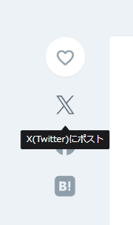
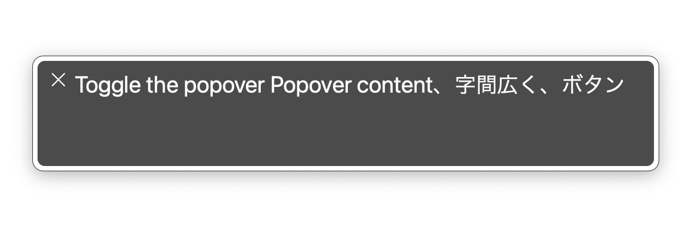

# 【Popover API/Tooltip Pattern】アクセシビリティのことを考えながらツールチップを実装する

## はじめに

これは 2024/11/23 に Zenn で投稿した記事の移植版です。

## そもそもツールチップとはなにか

ポップオーバーとも呼ばれる UI パーツです。
Zenn の記事を PC で開いた時、本文の左側にいくつかのアイコンが表示されていますね。Web に慣れたユーザーであれば、これらのアイコンを見て「記事をそれぞれのサービスでシェアするためのボタンかな」と推測することができるでしょう。但し、馴染みがないユーザーにとってはどうでしょうか。文字はなく、アイコンのみで表示されたボタンにどういったアクションがあるのか、瞬時に理解することは難しいでしょう。
この場合に有用なのがポップオーバーです。ホバーやフォーカスなどで追加の情報を表示させることができ、設置されている UI の意味を補足することができます。



### ポップオーバーとの違い

2つのワードの違いは明確に定義されているわけではありませんが、以下のように使い分けられていることが多いと認識しています。（個人的な理解であるため、誤っているかもしれません）

#### ツールチップ
トリガーへのインタラクションによって、ヒントや補足など、サービス利用をサポートする UI を表示する。一行程度の簡単なテキストであることが多い。コンテンツの表示非表示がトリガーに依存している。

#### ポップオーバー
トリガーへのインタラクションによって、追加要素など、サービス利用を拡張する UI を表示する。複数行の表示やリッチな HTML 要素であってもよい。トリガーへのインタラクションが外れても表示されていることがある。

この記事ではツールチップの実装を行います。そのため、ポップオーバーにも利用可能な項目でも、表記を「ツールチップ」に統一しています。

## Popover API の利用

Popover API は、 HTML 標準の API です。JavaScript を用いずにツールチップが実装でき、とても便利です。

https://developer.mozilla.org/ja/docs/Web/API/Popover_API

:::message
[2024年11月現在] 新しい API のため、モバイルでのサポートが不十分であることに注意してください。
:::

### まずは普通に Popover API を使ってみる

```html:テストコード（MDN より一部引用）
<button
  id="trigger"
  popovertarget="tooltip"
>
  Toggle the popover
</button>
<div
  id="tooltip"
  popover
>
  Popover content
</div>
```

popovertarget, popover という見慣れないプロパティがありますね。これらは Popover API で追加されたものです。

#### popovertarget

ツールチップとして連携したい要素の ID を与えることで、トリガー要素とツールチップ要素が紐づきます。

#### popover

ツールチップであることを指定します。`popovertarget` と紐付けられた要素にはこれが必要で、ないと Popover API が動作しません。
初期値は `auto` 。`popover` と `popover="auto"` は同義です。

|popover| auto| manual|
| ---- | ---- | ---- |
|外側をクリックで閉じる |◯ |×|
|Esc をクリックで閉じる |◯| ×|
|ポップオーバーの複数表示| × |◯|

`popover="auto"` である場合は自動状態と呼ばれ、キーボード操作の対応や表示数の制御など、簡単にツールチップを扱うことが可能です。
`popover="manual"` である場合は手動状態と呼ばれ、自動状態のようなサポートはなく、開発者が柔軟に実装することが可能です。
ただし、Popover API を `role="tooltip"` と併用する場合、`Esc` キー操作を担保すべきであることに注意してください。（[後述](#esc-%E3%82%AD%E3%83%BC%E3%81%A7%E3%83%84%E3%83%BC%E3%83%AB%E3%83%81%E3%83%83%E3%83%97%E3%82%92%E9%96%89%E3%81%98%E3%82%8B)）

https://developer.mozilla.org/ja/docs/Web/API/Popover_API/Using#%E8%87%AA%E5%8B%95%E7%8A%B6%E6%85%8B%E3%81%A8%E3%80%8C%E7%B0%A1%E5%8D%98%E3%81%AA%E8%A7%A3%E9%99%A4%E3%80%8D

## W3C で明示されているキーボードインタラクション

W3C で Tooltip の Keyboard interaction では、以下の通りアナウンスされています。

https://www.w3.org/WAI/ARIA/apg/patterns/tooltip/

### Esc キーでツールチップを閉じる

これは Popover API の `popover="auto"` で提供されている機能ですね。ツールチップ実装時、Popover API を利用していて、 `popover="auto"` である場合は、特に気にしなくてよい項目でしょう。ただし、`popover="manual"` を指定した場合、開発者側が実装する必要があります。

### ツールチップをホバーやフォーカスで発火させる

ホバーやフォーカスによってツールチップの発火を行うには、JavaScript の togglePopover() メソッドを用いて実装する必要があります。

```ts
const trigger = document.getElementById("trigger");
const tooltip = document.getElementById("tooltip");

const updateTooltip = (newState: boolean) => tooltip?.togglePopover(newState);

trigger?.addEventListener("mouseover", () => updateTooltip(true));
trigger?.addEventListener("mouseleave", () => updateTooltip(false));
trigger?.addEventListener("focus", () => updateTooltip(true));
trigger?.addEventListener("blur", () => updateTooltip(false));
```

#### ホバー・クリックを含むツールチップの発火について

発火タイミングが複数ある中で、「これとこれが同時に起きている場合はどうするんだっけ？」ということがあり、調査した中で共通していた仕様をまとめてみます。

:::message
今回は Google, Jira, MUI について調査を行いました。もちろんこれは一例であり、他サイトで異なる仕様が採用されていることもあります。
:::

|インタラクション|ツールチップ|
|---|---|
|ホバー|表示|
|ホバーが外れる|非表示|
|クリック|非表示|
|フォーカス|表示|
|フォーカスが外れる|非表示|

- ホバーしていて、クリックしたとき、ツールチップは消える。
- ホバーしていて、フォーカスしたとき、ツールチップはそのまま。
- ホバーしていて、フォーカスが外れたとき、ツールチップは消える。
- フォーカスしていて、ホバーしたとき、ツールチップはそのまま。
- フォーカスしていて、ホバーが外れたとき、ツールチップは消える。
- フォーカスしていて、クリックしたとき、ツールチップは消える。

特に優先すべきインタラクションというのはなく、ステート一つで管理しきることが可能な印象です。
個人的にはフォーカスさえあればホバー等でツールチップが消えたりはしないのかな？と思っていましたが、調査の結果、そうではないみたいで意外でした。

## ロールを指定してスクリーンリーダーに対応する

ツールチップと呼ばれる UI には `tooltip` という `aria-role` が用意されているため、これを付与します。また、トリガー要素に対しては `aria-describedby` の指定を行います。
これらの指定により、スクリーンリーダーがトリガー要素にフォーカスした際、ツールチップの内容を含めて読み上げてくれます。

```diff html:aria-role と aria-describedby の追加
 <button
   id="trigger"
+  aria-describedby="tooltip"
   popovertarget="tooltip"
 >
   Toggle the popover
 </button>
 <div
   id="tooltip"
+  aria-role="tooltip"
   popover
 >
   Popover content
 </div>
```

ツールチップ要素に指定した ID を `aria-describedby` に付与すると、トリガー要素と紐づけることができます。
試しに Mac の VoiceOver を用いて読み上げを行ってみました。



## おわりに

ツールチップの実装により新たな知見を得たため記事にまとめました。
どなたかの参考になれば幸いです。
